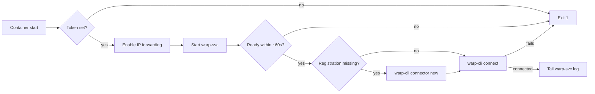

# cloudflare-mesh-docker

[](https://github.com/t0mer/cloudflare-mesh-docker/actions/workflows/docker-build.yml)
[](https://hub.docker.com/r/techblog/cloudflare-mesh)
[](LICENSE)

Runs the Cloudflare WARP Connector (now Cloudflare Mesh) inside a Docker container instead of installing it directly on the host OS.

The image installs the official `cloudflare-warp` package from Cloudflare's APT repository on Ubuntu 24.04, registers the
connector with a token you supply at runtime, and keeps it connected. This lets a Docker host act as a WARP Connector (now Cloudflare Mesh)
node for a Cloudflare Zero Trust network without installing any Cloudflare software on the host itself.

## Table of contents

- [Features](#features)
- [How it works](#how-it-works)
- [Requirements](#requirements)
- [Quick start](#quick-start)
- [Configuration](#configuration)
- [Permissions](#permissions)
- [Persistence](#persistence)
- [Security](#security)
- [Troubleshooting](#troubleshooting)
- [Building locally](#building-locally)
- [GitHub Actions](#github-actions)
- [Contributing](#contributing)
- [License](#license)

## Features

- Official `cloudflare-warp` package installed from `pkg.cloudflareclient.com` (signed APT repository).
- Token-based connector registration on first start (`warp-cli connector new`); the token is never baked into the image.
- Skips registration on later starts when the registration is already present (with a persisted volume).
- Enables IPv4/IPv6 forwarding at startup so the host can route traffic for the network behind it.
- Waits for the WARP daemon (`warp-svc`) to become ready and prints its log on failure.
- Streams the `warp-svc` log to `docker logs`.
- Multi-arch image on Docker Hub: `linux/amd64` and `linux/arm64`.

## How it works

On start, `entrypoint.sh`:

1. Exits with an error if `CF_WARP_CONNECTOR_TOKEN` is not set.
2. Tries to enable IP forwarding with `sysctl` (`net.ipv4.ip_forward=1`, `net.ipv6.conf.all.forwarding=1`,
   `net.ipv6.conf.all.accept_ra=2`). Failures are ignored.
3. Starts the `warp-svc` daemon in the background, logging to `/var/log/warp-svc.log`.
4. Polls `warp-cli --accept-tos status` every 2 seconds, up to 30 times (about 60 seconds). If the daemon is still not
   ready, it prints the daemon log and exits.
5. If the status contains `Registration Missing`, registers the connector with
   `warp-cli --accept-tos connector new "$CF_WARP_CONNECTOR_TOKEN"`. Otherwise it assumes the connector is already registered.
6. Runs `warp-cli --accept-tos connect`. On failure it prints the status and the daemon log and exits.
7. Prints the WARP status, then follows the daemon log. The container runs for as long as `warp-svc` runs.



## Requirements

- A Linux Docker host (`linux/amd64` or `linux/arm64`) with Docker, or Docker Compose for the Compose example.
- The ability to run a privileged container with host networking (see [Permissions](#permissions)).
- A Cloudflare Zero Trust account and a Cloudflare Mesh node token (WARP Connector is now called Cloudflare Mesh).
  In the Cloudflare Zero Trust dashboard, go to **Networking** > **Mesh** > **Add participant** > **Add node** to create
  the node and get its token. See Cloudflare's
  [Cloudflare Mesh documentation](https://developers.cloudflare.com/cloudflare-one/networks/connectors/cloudflare-mesh/)
  and [getting started guide](https://developers.cloudflare.com/mesh/get-started/) for the Cloudflare-side setup.

## Quick start

The image is published on Docker Hub as [`techblog/cloudflare-mesh`](https://hub.docker.com/r/techblog/cloudflare-mesh).

### Docker run

```bash
docker run -d \
  --name cloudflare-mesh \
  --restart unless-stopped \
  --privileged \
  --network host \
  -e CF_WARP_CONNECTOR_TOKEN="TOKEN_HERE" \
  -v cloudflare-warp-data:/var/lib/cloudflare-warp \
  techblog/cloudflare-mesh:latest
```

### Docker Compose

```yaml
services:
  cloudflare-mesh:
    image: techblog/cloudflare-mesh:latest
    container_name: cloudflare-mesh
    restart: unless-stopped
    privileged: true
    network_mode: host
    environment:
      CF_WARP_CONNECTOR_TOKEN: "${CF_WARP_CONNECTOR_TOKEN}"
    volumes:
      - cloudflare-warp-data:/var/lib/cloudflare-warp

volumes:
  cloudflare-warp-data:
```

```bash
export CF_WARP_CONNECTOR_TOKEN="TOKEN_HERE"
docker compose up -d
```

### Verify

```bash
docker logs cloudflare-mesh
docker exec -it cloudflare-mesh warp-cli status
```

The log contains `[INFO] Cloudflare WARP Connector is running.` once the connector is connected. After that line, the
container keeps streaming the `warp-svc` log.

## Configuration

| Environment variable | Required | Default | Description |
|---|---|---|---|
| `CF_WARP_CONNECTOR_TOKEN` | Yes | none | WARP Connector (now Cloudflare Mesh) node token from the Cloudflare Zero Trust dashboard. Used only when the connector is not yet registered. The container exits if it is empty. |

There are no other options. The image has no exposed ports; it uses the host network.

## Permissions

The container requires elevated permissions because WARP creates network interfaces and modifies routing:

- `--privileged`: grants all capabilities, which also lets the `sysctl` IP-forwarding settings in the entrypoint apply.
- `--network host`: used so the connector routes traffic for, and changes routing on, the host's network. Host networking
  is not a general requirement of Cloudflare Mesh in containers, but the examples here rely on it.

Instead of `--privileged`, Cloudflare's
[guide to running Mesh in containers](https://developers.cloudflare.com/mesh/guides/run-mesh-in-containers/) grants
explicit capabilities and the TUN device:

```bash
--cap-add NET_ADMIN \
--cap-add NET_RAW \
--device /dev/net/tun
```

Without `--privileged`, the entrypoint's `sysctl` calls fail silently (their errors are ignored), so IP forwarding is not
enabled by the container. Enable it on the host, or pass the settings with `--sysctl` (for example
`--sysctl net.ipv4.ip_forward=1`) where Docker allows it for your network mode.

## Persistence

Mount `/var/lib/cloudflare-warp` as a volume (shown in both examples above) so that the WARP registration is preserved
across container restarts and re-creation. Without it, the connector registers again with the token each time the
container is re-created.

The entrypoint only registers when the registration is missing. If you change `CF_WARP_CONNECTOR_TOKEN` while an existing
registration is persisted, the new token is not used until you remove the volume.

## Security

- The connector token is never baked into the image. It must be passed at runtime via the `CF_WARP_CONNECTOR_TOKEN`
  environment variable. Prefer an `.env` file or a secret store over typing it on the command line.
- The token is visible to anyone who can run `docker inspect` on the container, and it is passed as a command-line argument
  to `warp-cli` during registration. Restrict access to the Docker host accordingly.
- The container runs privileged with host networking and enables IP forwarding on the host. Run it only on hosts you
  intend to use as a network gateway.

## Troubleshooting

- **`CF_WARP_CONNECTOR_TOKEN environment variable is required`**: the variable is missing or empty.
- **`warp-svc did not become ready`**: the daemon did not respond within about 60 seconds. The daemon log is printed right
  after this message. Check that the container runs with `--privileged` (or the capabilities above).
- **`Failed to connect WARP`**: check the status and daemon log printed after the message, and that the token is valid.

Useful commands:

```bash
# Stream container logs
docker logs -f cloudflare-mesh

# Check WARP status
docker exec -it cloudflare-mesh warp-cli status

# Check tunnel stats
docker exec -it cloudflare-mesh warp-cli tunnel stats

# Inspect routing table
docker exec -it cloudflare-mesh ip route

# Inspect network interfaces
docker exec -it cloudflare-mesh ip addr
```

## Building locally

```bash
# Single-arch image for the local machine
docker build -t techblog/cloudflare-mesh:latest .

# Multi-arch build (requires Buildx; add --push or --load as needed)
docker buildx build --platform linux/amd64,linux/arm64 -t techblog/cloudflare-mesh:latest .
```

The `cloudflare-warp` package version is not pinned: each build installs the latest version from Cloudflare's repository.

## GitHub Actions

Both workflows run on manual trigger (`workflow_dispatch`) only.

- `.github/workflows/docker-build.yml` builds and pushes a multi-arch image (`linux/amd64`, `linux/arm64`) to Docker Hub
  as `techblog/cloudflare-mesh:latest` and `techblog/cloudflare-mesh:<version>`, where `<version>` comes from `git describe --tags`
  with a fallback to the short commit SHA. The checkout is shallow and does not fetch tags, so in practice `<version>` is
  the short commit SHA unless the workflow is dispatched from a tag ref.
- `.github/workflows/publish-ghcr.yml` is meant to build for `linux/amd64`, `linux/arm64`, and `linux/arm/v7` and push to
  `ghcr.io/t0mer/cloudflare-mesh` with the `latest` tag and an optional tag input, using the built-in `GITHUB_TOKEN`.
  This workflow has never run, so no image is published on GHCR. As written, the `linux/arm/v7` build cannot succeed:
  Cloudflare's APT repository only provides `cloudflare-warp` for `amd64` and `arm64`.

Required repository secrets for the Docker Hub workflow:

| Secret | Description |
|---|---|
| `DOCKERHUB_USERNAME` | Docker Hub account username |
| `DOCKERHUB_TOKEN` | Docker Hub access token |

## Contributing

Issues and pull requests are welcome at [t0mer/cloudflare-mesh-docker](https://github.com/t0mer/cloudflare-mesh-docker).

## License

Licensed under the [Apache License 2.0](LICENSE).
